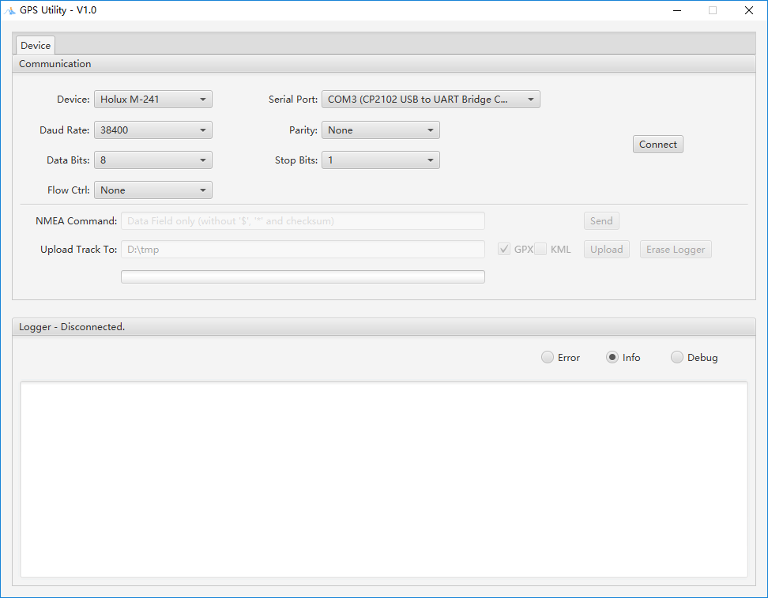

# GPS Utility

A small utility for GPS data logger configuration, log data upload via serial port or Bluetooth. (should be working on all Windows, Linux and MacOS) With the design framework, it is easy to introduce new loggers supported, if the communication protocol is clear.

----

## Pre-requisites

Java 8(+) + JavaFX 
*(Oracle JDK8 or OpenJDK8+OpenJFX)*

## GPS data loggers

- Holux M-241 
The orange one has been verified. 
*New model in white was not tested.*

- Holux GR-245 
Not tested.

- Holux M-1200 
Not tested.

## Data Format

GPX 1.1 compliant 
KML (To be implemented)

## Screenshots

 

 

 
